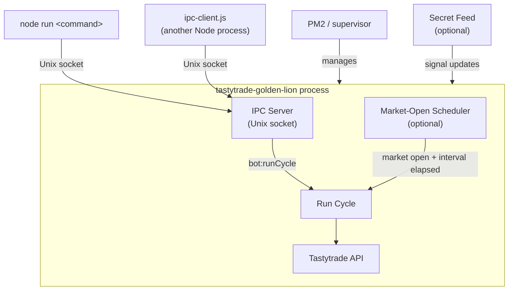

# Tastytrade Golden Lion

A production options execution engine for Tastytrade — automated, risk-gated, and fully inspectable.

The scheduler runs a full allocation and risk-management cycle at a configurable interval during market hours. Each cycle enforces entry criteria, sizes positions against real capital, applies strategy-level risk rules, and records structured reasoning for every decision. All workflows are also available on demand over a local Unix IPC socket — candidate discovery, health checks, order placement, and cycle control — with or without the scheduler running.

## System Profile

Golden Lion is built as an execution control plane, not just a script runner.

- Deterministic run cycle: each cycle builds a full context snapshot, evaluates group-level strategy decisions, then executes allocation, close, and seed actions with explicit reasoning recorded for every step.
- Execution quality controls: IV rank filtering and bid/ask spread checks gate every entry. Orders are routed across bid/mid/ask using configurable weights, and aggressiveness can tick toward ask in bounded steps to improve fill probability without unconstrained price chasing.
- Risk-first circuit breakers: strategy logic enforces profit capture targets, drawdown floors, cooldown periods, no-buy cutoffs, and end-of-day position constraints before any order is placed.
- Multi-account aware: the cycle can run account-specific or fan out across all managed accounts, with cash and margin policies — including position sizing and exposure caps — applied independently per account type.
- Session-gated automation: the scheduler checks live Tastytrade session status and only runs during regular equities options windows. Extended-hours sessions are never treated as open.
- Optional signal ingestion: an external feed can influence buy-weighting and trigger auto-seed actions, but the engine is fully operational without it.
- Audit trail by default: each run appends structured NDJSON history (plan, decisions, execution summary, snapshot metrics) for after-action review and debugging.

## Operating Model

At a high level, each cycle follows this sequence:

1. Pull balances, positions, market session state, and optional secret-signal context.
2. Build execution targets (time-of-day DTE, exposure target, bid/mid/ask route weights).
3. Evaluate every position group against strategy rules (profit capture, drawdown floors, cooldowns, no-buy cutoffs, EOD behavior).
4. Generate an execution plan and route order sizing by available capital and route weights.
5. Execute and record outcomes, including placement/skips, close actions, overnight reductions, and cross-account seed decisions.

## Runtime Topology



## Setup

### 1. Clone and Install

```bash
git clone <repo-url> ~/code/tastytrade-golden-lion
cd ~/code/tastytrade-golden-lion
npm install
```

### 2. Configure Environment

```bash
cp .env.example .env
# open .env and fill in required values (see credentials section below)
```

### 3. Obtain API Credentials

`API_CLIENT_SECRET` and `API_REFRESH_TOKEN` come from Tastytrade's OAuth2 flow. Follow the [Tastytrade OAuth2 guide](https://developer.tastytrade.com/oauth/) to register an application and obtain these values. The SDK automatically refreshes the access token at runtime — you only need to supply the long-lived refresh token.

## Environment Variables

### Required

- `BASE_URL` — Tastytrade API base URL. Defaults to `https://api.tastyworks.com`.
- `API_CLIENT_SECRET` — OAuth2 client secret from Tastytrade.
- `API_REFRESH_TOKEN` — long-lived refresh token from Tastytrade's OAuth2 flow.

### Optional Runtime Controls

#### Bot Scheduling

- `BOT_RUN_ON_SCHEDULE` — Set to `true` to start the market-open scheduler when the process boots. Defaults to `false`.
- `BOT_RUN_INTERVAL_MS` — Scheduler interval in milliseconds while the market is open.
- `BOT_RUN_INTERVAL_MINUTES` — Scheduler interval in minutes. Used when `BOT_RUN_INTERVAL_MS` is not set.

#### Bot Trading Controls

- `BOT_DO_NOT_TOUCH_GROUPS` — Comma-separated group keys the bot should leave alone.
- `BOT_READ_ONLY_ACCOUNTS` — Comma-separated account numbers the bot can inspect but should not trade.
- `BOT_MARGIN_SEED_FROM_CASH_MIN_DOWN_PCT` — Minimum cash-position ask-return loss percentage before the bot considers seeding the margin account. Leave unset to disable this feature.
- `BOT_MARGIN_SEED_FROM_CASH_MAX_DOWN_PCT` — Maximum loss percentage allowed for margin seeding. This prevents seeding when the cash position is already too close to the bid stop-loss floor. Defaults to `14`.
- `BOT_INTRADAY_STOP_LOSS_PCT` — Intraday bid-return loss floor before the bot cuts off accumulation. Defaults to `30`.
- `BOT_EOD_STOP_LOSS_PCT` — End-of-day bid-return loss floor after the accumulation cutoff. Defaults to `7`.
- `BOT_MAX_ASK_RETURN_PERC_FOR_BUY` — Optional override for the maximum ask-return threshold used on buy orders. Unset by default; `.env.example` uses `0.2`.

#### Position Gate Signal Settings (both accounts)

- `BOT_CROSS_ACCOUNT_YES_DOWN_PCT` — How far down the cash position must be before it can create a cross-account yes signal. Defaults to `7`.
- `BOT_GATE_STRONG_STOCK_YES_MAX_PCT` — Maximum `percentOfBalance` allowed for a strong stock yes signal. Defaults to `30`.
- `BOT_GATE_STRONG_DAYTRADE_SCORE_MAX` — Daytrade score magnitude threshold for a strong yes signal. Defaults to `100`.
- `BOT_GATE_SINGLE_YES_MAX_TARGET_PCT` — Maximum target exposure when there is one yes signal. Defaults to `0.15`.
- `BOT_GATE_BOTH_YES_MAX_TARGET_PCT` — Maximum target exposure when both the cross-account yes signal and the basic stock yes signal are true. Defaults to `0.25`.
- `BOT_GATE_STRONG_YES_MAX_TARGET_PCT` — Maximum target exposure when a strong stock yes signal is present. Defaults to `0.35`.
- `BOT_MARGIN_MAX_TARGET_MULTIPLIER` — Multiplier applied to the gate ceiling for margin accounts. Defaults to `1.33`.
- `BOT_MARGIN_CROSS_ACCOUNT_THRESHOLD_MULTIPLIER` — Makes the cross-account threshold stricter for margin accounts. Defaults to `2`.
- `BOT_GATE_BOOLEAN_BOOST_PCT` — Additional max target percentage added for each favorable boolean signal. Defaults to `0.03`.

#### Position Management

- `BOT_MAX_SEED_ORDER_COST` — Maximum estimated dollar cost for a single seed order. Defaults to `200`.
- `BOT_MAX_OPTION_SPREAD_PCT` — Maximum bid/ask spread as a fraction of the midpoint. Defaults to `0.3`.
- `BOT_MARGIN_MAX_BUY_EXPOSURE_PCT` — Maximum fraction of total capital used for one margin allocation action. Defaults to `0.012`.
- `BOT_CASH_MAX_BUY_EXPOSURE_PCT` — Maximum fraction of total capital used for one cash allocation action. Defaults to `0.05`.
- `BOT_CASH_ACCOUNT_MAX_BUYING_POWER_PCT` — Maximum fraction of cash buying power the bot can deploy in a day. Defaults to `0.6`, capped at `0.9`.
- `BOT_OVERNIGHT_REDUCTION_DAYS_TO_SELLOFF` — Calendar days until a cash overnight position should be fully sold off. Defaults to `6`.
- `BOT_OVERNIGHT_REDUCTION_START_FLOOR_PCT` — Exposure floor percentage on day 1 of overnight reduction; interpolates linearly to `0` by the selloff day. Defaults to `20`.
- `BOT_MIN_IV_RANK_PCT` — Minimum IV rank (`0`–`100`) required before entering a position. Defaults to `20`; set to `0` to disable.
- `BOT_MARGIN_TARGET_CALL_DELTA` — Target absolute delta for OTM call strike selection on margin accounts. Defaults to `0.35`.
- `BOT_OPTION_MARKET_SNAPSHOT_TTL_MS` — Cache TTL for option snapshot lookups. Defaults to `30000`; set to `0` to disable.
- `BOT_MARGIN_MAX_TARGET_DTE` — Hard ceiling on target DTE for margin accounts. Defaults to `7`.
- `BOT_CASH_MIN_TARGET_DTE` — Hard floor on target DTE for cash accounts. Defaults to `7`.

#### Secret Feed Integration (Optional)

If these are omitted or the feed is disconnected, the runtime continues normally and manual IPC workflows remain fully available.

- `SECRET_SOCKET_URL` — Private feed socket URL.
- `SECRET_SOCKET_TIMEOUT_MS` — Timeout for feed requests in milliseconds. Defaults to `5000`.
- `SECRET_DATA_UPDATE_POSITIONS_KEY` — Positions key inside the secret feed payload.
- `SECRET_AUTO_SEED_ON_POSITIONS_UPDATE` — Set to `true` to allow auto-seeding when position updates arrive. Defaults to `false`.
- `SECRET_AUTO_SEED_ON_TICKER_RECS_UPDATE` — Set to `true` to allow auto-seeding when ticker recommendations update. Defaults to `false`.
- `SECRET_AUTO_SEED_START_TIME` — Start of the auto-seed window in `HH:mm` format. Defaults to `06:30`.
- `SECRET_AUTO_SEED_COOLDOWN_MS` — Minimum delay between secret-feed auto-seeds for the same symbol. Defaults to `600000`.

#### Paths / Overrides

- `TASTYTRADE_BOT_SOCKET` — Override the IPC socket path.
- `TASTYTRADE_BOT_DATA_DIR` — Override the root data directory. Defaults to `data/`; controls where run history, day reports, and the position registry are stored.

## Running Tests

```bash
npm test
```

Runs the built-in Node test runner against `src/**/*.test.ts` via `tsx`. Note that `npm run typecheck` and the test suite verify code correctness — they don't exercise live API calls or the scheduler loop.

## Typecheck And Build

This project usually runs directly from TypeScript via `tsx`.

```bash
npm run typecheck
npm run build
```

- `typecheck` validates types only.
- `build` creates a bundled entrypoint at `build/index.js`.

## Run With IPC

`node run` is a thin CLI wrapper over `ipc-client.js`. It opens a JSON request over the local Unix socket to the running server and prints the result. The server must be running first.

Start the server in one terminal:

```bash
npm run start:tsx
```

Or run the build:

```bash
npm run start:build
```

The server listens on a local Unix socket (default: `.tastytrade-golden-lion.sock`).

In another terminal, send commands through IPC.

### Core / Market Data Examples

```bash
node run core:getBidAskForSymbol AAPL
node run core:getUnderlyingPrice AAPL
node run core:fetchOptionChainWithVolume RUM
node run core:getBalanceSummary
node run core:getCurrentEquitiesSession
node run core:isEquityOptionsMarketOpen
```

### Candidate / Health Examples

```bash
node run bot:getOptionCandidates RUM call
node run bot:getTopOptionCandidateForSymbol RUM call 5WI88116
node run bot:getTopOptionCandidateForSymbol RUM call 5WU18519
node run bot:getOptionHealthForSymbol RUM call
node run bot:getOptionHealthForSymbol RUM call 14
```

`bot:getOptionHealthForSymbol` returns target checks for `7`, `14`, and `30` DTE and includes summary fields like `healthyTargets`, `missingTargets`, and `fallbackTargets`.

### Allocation / Run Cycle Examples

```bash
node run bot:getCurrentAllocationBudget
node run bot:getTimeOfDayExecutionTargets 10:14
node run bot:getRecentRunHistory 20
node run bot:getRunCyclePreview
node run bot:runCycleLogOnly
node run bot:runCycle
node run bot:seedSymbol RUM call
node run bot:purchaseSymbol RUM 1000
node run bot:getSecretSocketStatus
node run bot:getLastRunGroupsByTickers RUM,TSLA
```

### Day Report Examples

```bash
node run bot:getDayReport                          # latest snapshot for all accounts
node run bot:getDayReport 5WI88116                 # history for one account
node run bot:getDayReport 5WI88116 2026-06-30      # specific date
node run bot:getDayTrend                           # live snapshot vs last stored baseline
node run bot:getDayTrend 5WI88116                  # single account
node run bot:getClosedPositionsToday               # all positions closed today with realized P&L
node run bot:recordDayReport                       # force-record a snapshot now (bypasses 1pm gate)
node run bot:recordDayReport 5WI88116              # single account
```

`bot:purchaseSymbol` format:

```text
bot:purchaseSymbol <symbol> <dollars> [call|put] [accountNumber]
```

## Supported IPC Commands

```text
core:getBidAskForSymbol <symbol> [timeoutMs]
core:getUnderlyingPrice <symbol> [timeoutMs]
core:getPositionsAndBalances [accountNumber]
core:getBalanceSummary [accountNumber]
core:cancelAllLiveOrders [accountNumber]
core:fetchOptionChainWithVolume <symbol>
core:getCurrentEquitiesSession
core:isEquityOptionsMarketOpen
bot:getOptionCandidates <symbol> [call|put]
bot:getTopOptionCandidateForSymbol <symbol> [call|put] [accountNumber]
bot:getOptionHealthForSymbol <symbol> [call|put] [targetDTE]
bot:getOptionMarketSnapshotCacheStats
bot:resetOptionMarketSnapshotCacheStats [clearCache=true|false]
bot:getCurrentAllocationBudget [accountNumber]
bot:getSecretSocketStatus
bot:debugSecretExecutionTargetForSymbol <symbol> [askReturnPerc] [timeSinceLastActionMinutes] [currentExposurePct]
bot:seedSymbol <symbol> [call|put] [accountNumber]
bot:getTimeOfDayExecutionTargets <HH:mm>
bot:getRecentRunHistory [limit]
bot:getLastRunGroupsByTickers <commaSeparatedSymbols>
bot:getRunCyclePreview [accountNumber]
bot:runCycleLogOnly [accountNumber]
bot:runCycle [accountNumber]
bot:purchaseSymbol <symbol> <dollars> [call|put] [accountNumber]
bot:getLastRunCycle
bot:startMarketOpenScheduler
bot:stopMarketOpenScheduler
bot:getMarketOpenSchedulerStatus
bot:getDayReport [accountNumber] [date YYYY-MM-DD]
bot:getDayTrend [accountNumber]
bot:getClosedPositionsToday [accountNumber]
bot:recordDayReport [accountNumber]
core:listCommands
```

## Data Storage

All persistent data lands under `data/` (or `TASTYTRADE_BOT_DATA_DIR` if set).

| Path | Format | Contents |
|---|---|---|
| `data/runs/{account}-{type}.ndjson` | NDJSON | One entry per bot cycle: position evaluations, strategy decisions, orders placed, snapshot metrics |
| `data/runs/position-registry.json` | JSON | Per-position open/close timestamps and closing order IDs; used for overnight detection and position age |
| `data/day-reports/{account}-{type}.ndjson` | NDJSON | One entry per account per day (recorded after 1pm PST on first post-cutoff cycle): net liq, capital, per-position bid/mid/ask unrealized returns |

**Run history** is the primary audit trail — every cycle is recorded regardless of whether orders were placed. Useful for debugging strategy decisions and reconstructing what the bot saw at any point in time.

**Position registry** tracks when each option contract was opened and closed. Used internally to identify overnight positions for forced close-at-open logic.

**Day reports** are end-of-day account snapshots. Used by `bot:getDayTrend` to diff current live state against the prior day's baseline.

## Market-Open Scheduler

The scheduler uses Tastytrade's session endpoint:

- `GET /market-time/equities/sessions/current`

It runs only during regular equities session windows. Extended-hours sessions are not treated as open for options execution.

Scheduler behavior is stateful and introspectable so operators can verify timing and in-flight status over IPC.

| State | Meaning | Next transition |
|---|---|---|
| `stopped` | Scheduler not started | → `waiting-for-open` on start |
| `waiting-for-open` | Polling every 60s; market closed (or last run errored) | → `running` when market opens and interval has elapsed |
| `running` | `runBotCycle()` in-flight | → `waiting-for-next-run` on success; → `waiting-for-open` on error |
| `waiting-for-next-run` | Market is open; holding until next interval elapses | → `running` when interval elapses; → `waiting-for-open` if market closes |

Auto-start scheduler on boot:

```bash
BOT_RUN_ON_SCHEDULE=true npm run start:tsx
```

Manual scheduler control via IPC:

```bash
node run bot:startMarketOpenScheduler
node run bot:getMarketOpenSchedulerStatus
node run bot:stopMarketOpenScheduler
```

## Running With PM2

An `ecosystem.config.cjs` is included for production deployment with PM2.

```bash
npm run build
pm2 start ecosystem.config.cjs
pm2 save
```

The config registers the app as `tastytrade-golden-lion`, runs `build/index.js` in fork mode with `autorestart: true`, and sets `BOT_RUN_ON_SCHEDULE=true` by default. Credentials and runtime overrides should be set in `.env` — PM2 inherits the process environment, so `.env` is still loaded via `dotenv` at startup.

To regenerate the startup hook so PM2 survives a reboot:

```bash
pm2 startup   # follow the printed instruction
pm2 save
```

Common PM2 operations:

```bash
pm2 status
pm2 logs tastytrade-golden-lion
pm2 restart tastytrade-golden-lion
pm2 stop tastytrade-golden-lion
```

## Reusable IPC Client

From another local Node process, you can call the server directly with the reusable client:

```js
import { sendIpcCommand } from "./ipc-client.js";

const optionHealth = await sendIpcCommand(
  "bot:getOptionHealthForSymbol",
  ["RUM", "call"],
  {
    socketPath: "/absolute/path/to/tastytrade-golden-lion/.tastytrade-golden-lion.sock",
  },
);
```

If you copy `ipc-client.js` into another project, either pass `socketPath` explicitly or override `socketFileName` / `envVarName` when resolving socket paths.

## How It Works

- `npm run start:tsx` starts the IPC server from TypeScript via `tsx`.
- `npm run build` bundles the server with `esbuild`.
- `npm run start:build` runs the bundled output.
- `ipc-client.js` sends JSON requests over `node:net` to the local socket.
- `node run ...` is a thin CLI wrapper over `ipc-client.js`.
- The server resolves a command route and returns JSON responses.
- On startup, the runtime installs a quote-streamer fatal error guard that exits the process on unrecoverable feed conditions so PM2 (or another supervisor) can restart cleanly.

## Execution Strategy Highlights

- Time-adaptive exposure control: target DTE and target exposure shift over the session, with account-specific behavior for cash vs margin.
- Price-route allocation: orders are split across bid/mid/ask using weighted routes, then contract counts are allocated against real capital limits.
- Controlled aggressiveness: route execution can tick up toward ask in bounded steps to improve fill probability without unconstrained chasing.
- Risk-first circuit breakers: strategy logic can force closes on profit capture, severe loss thresholds, and end-of-day constraints.
- Overnight handling: margin positions flagged as overnight can be force-closed at open, while cash accounts can execute gradual overnight reductions.
- Cross-account seeding: cash-account conditions can trigger margin-account seed flow when configured thresholds are met.

## Operational Notes

- If IPC calls fail to connect, start or restart the server.
- API calls depend on valid `.env` credentials.
- Socket path can be overridden with `TASTYTRADE_BOT_SOCKET`.
- Run interval can be tuned with `BOT_RUN_INTERVAL_MS` or `BOT_RUN_INTERVAL_MINUTES`.
- All data output can be redirected with `TASTYTRADE_BOT_DATA_DIR`.
- Source imports intentionally use extensionless TypeScript paths because runtime execution goes through `tsx` with bundler-style resolution.
